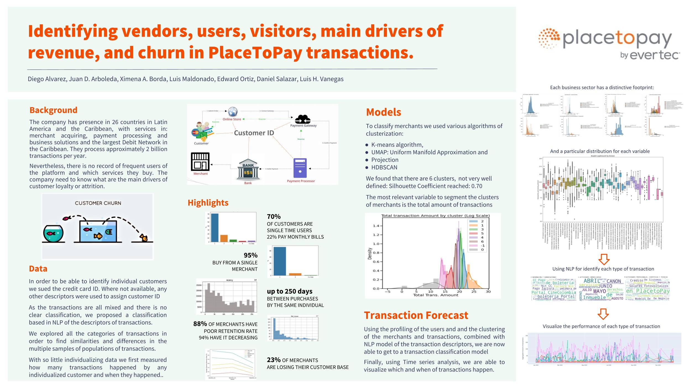
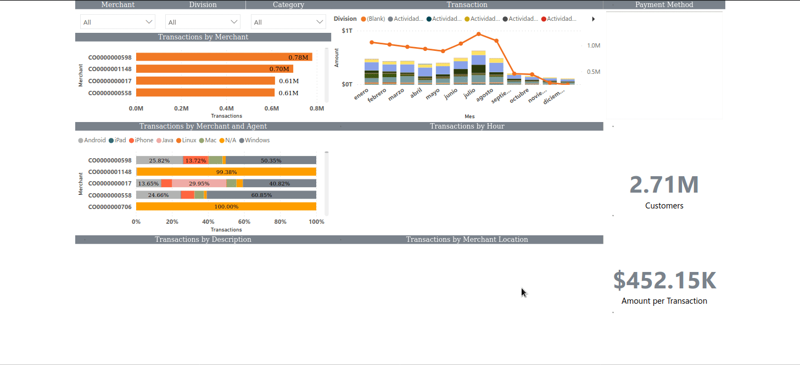
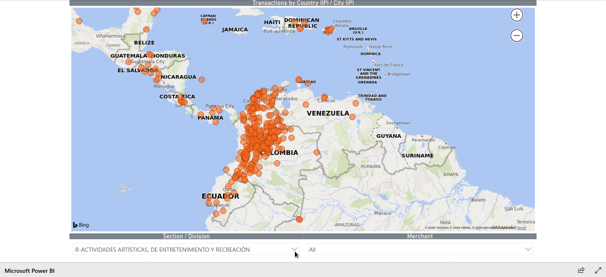

# PlacetoPay Recommender System Demo

## About this app

This app is part of the Final Capstone Project for the program Data Science For All program Colombia 3.0

This is a private project of PlacetoPay/Evertec. The complete datasets and complete documentation of this project are property of that company and are not available here. Here we publish the demo of a Dashboard built for showing the proof of concept of a recommender system that uses mock data. 

This is a Git version controlled repository. The notebooks section store all the notebooks used in making experiments and analysis for the proyect.

## Problem:

The particular problem of the entity is that their data is sparse and it lacks a concise categorization and they need to identify customers, being they payers or merchants, and the most important drivers off behavior using their payments processing platform. This project started during 2020 running experiments to gather data, transform it and test if it was feasible to answer business questions with it.

Then, after a lenghty analysis of the datasets, there were defined new descriptive variables for each transaction in a **Feature Engineering** process that involved using Natural Language Processing to generate new descriptors and classifiers. Using that information, a **Clustering Model** for transactions, payer customers and merchant customers were developed. And finally, a **Recommender System** were implmented using those new features and a **Collaborative Filtering** custom made algorithm 

## Goals

The goal of this project is to provide a Dashboard to visualize the datasets of the entity, and the proof of concept of a recommender system in a Web App.

## Users and audience

This project is not totally public, so there are only temporary public web apps and the datasets are not public. this project is only to showcase the feasibility of the system and is intended for the use of the company and academic purposes for the program. 

It is also expected that the user is familiarized with programing, executing and debugging Data Analytics tasks, like data cleaning, data wrangling and statistical description of the data. Libraries used include Pandas, Scikit-learn, NLTK, Plot.ly, Seaborn, among others.

Here is a Datafolio description of the process:



_Demo: Recommender System Proof of concept for Placetopay._

You can check the resulting web page in [https://t67-ptp-recosystem.herokuapp.com/](https://t67-ptp-recosystem.herokuapp.com/) (page in English)


## How to run this app (locally)

(The following instructions apply to macOS/linux command line.)

To run this app first clone repository and then open a terminal.

```
git clone https://github.com/edward0rtiz/team67-ptp.git
```

Install the requirements:
it is suggested that you use a virtual environment (virtualenv / Anaconda / docker image) where all the requirement packets will be stored.

```
pip install -r requirements.txt
```

Run the app:

```
python3 app.py
```

You can run the app on your browser at http://127.0.0.1:8050

## Screenshots





